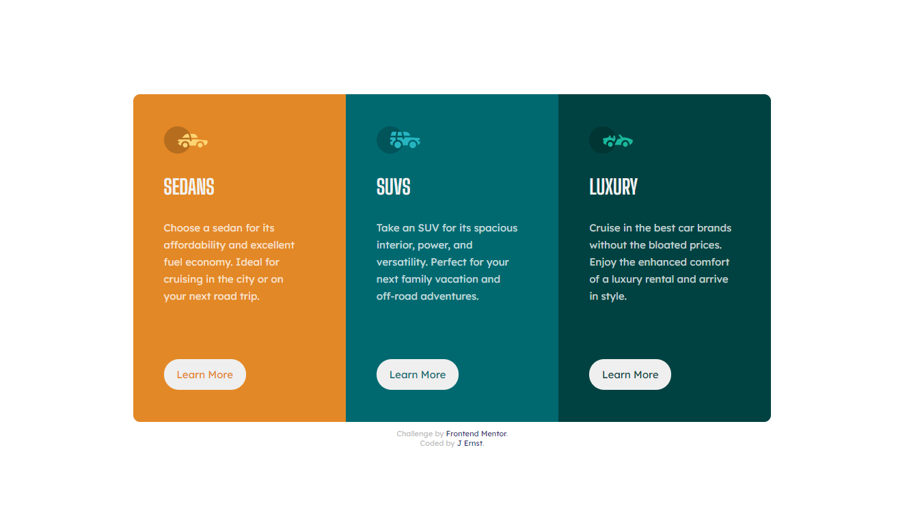

# Frontend Mentor - 3-column preview card component solution

This is a solution to the [3-column preview card component challenge on Frontend Mentor](https://www.frontendmentor.io/challenges/3column-preview-card-component-pH92eAR2-). Frontend Mentor - Challenges to help you improve your coding skills by building realistic projects. 

## Overview

This was my first time building with a mobile-first approach, and also the first time I was able to make a layout that is (properly) responsive. All in all, this project was great practice for the basics of HTML and CSS, and I've definitely picked up on a a few new concepts while working on it. 

### The challenge

Users should be able to:

- View the optimal layout depending on their device's screen size
- See hover states for interactive elements

### Screenshot

### Links

- Solution URL: [https://www.frontendmentor.io/solutions/mobile-first-layout-using-flexbox-ddscVtqFx]
- Live Site URL: [https://nimkamjoon.github.io/3-column-preview-card-component/]

### Built with

- HTML5 markup
- CSS custom properties
- Flexbox
- Mobile-first workflow

## Author

Jota Ernst (@nimkamjoon)
